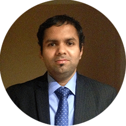

 
 

 

## About
I am an Assistant Professor at the Electrical Engineering Dept., [Indian Institute of Science](http:www.iisc.ernet.in), Bangalore. My research interests are in signal processing, machine learning, deep learning and neuroscience with applications to robust speech recognition, speech enhancement, speech coding and audio analytics including biometrics. 

Before joining as a faculty member at the Indian Institute of Science, I spent 4 years as a Research Staff Member at the [IBM T.J. Watson Research Center](http://www.research.ibm.com/labs/watson) in Yorktown Heights, NY, USA. I completed my Ph.D. with [Prof. Hynek Hermansky](http://www.clsp.jhu.edu/~hynek), at Center for Language and Speech Processing, Dept. of ECE, Johns Hopkins University, USA.

## Laboratory  
[Learning and Extraction of Acoustic Patterns, LEAP](http://leap.ee.iisc.ac.in)

## Contact  
C334, Electrical Engineering, IISc  
+91 80 2293 2433  
sriram at ee dot iisc dot ernet dot in